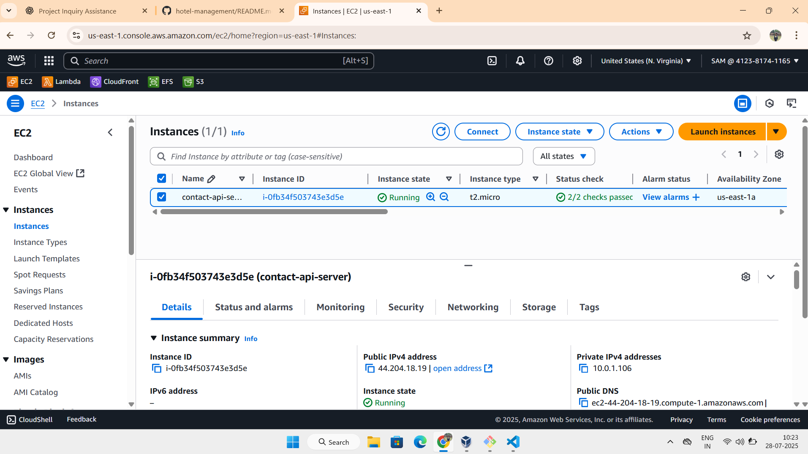
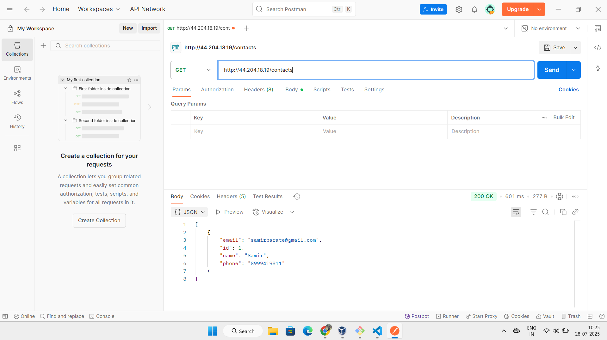
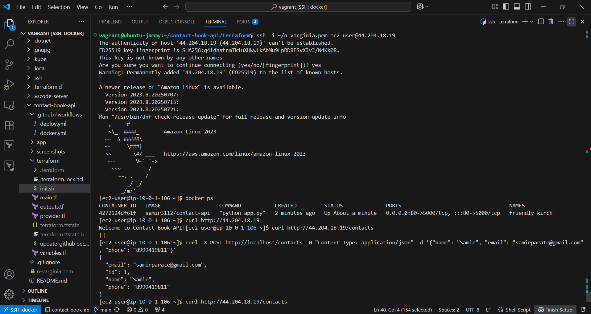
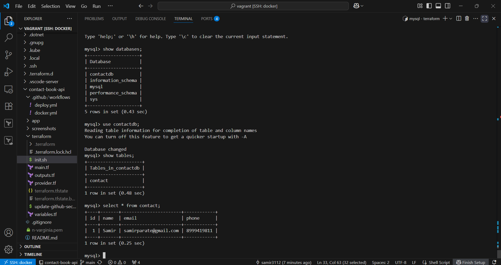
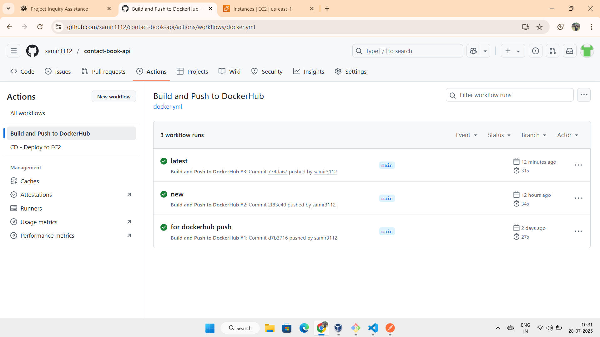
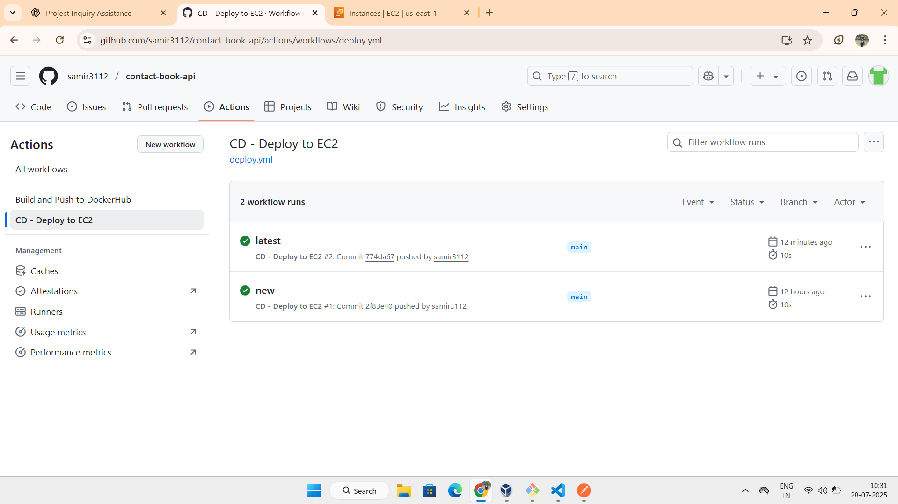

# 📞 Contact Book API – Flask + Docker + Terraform + AWS + GitHub Actions

A fully containerized **REST API** built with Flask, deployed on **AWS EC2** using **Terraform**, and integrated with **MySQL (RDS)** and **CI/CD via GitHub Actions**.

---

## 🛠️ Tech Stack

| Layer            | Tech Used                              |
|------------------|----------------------------------------|
| Backend API      | Python Flask + SQLAlchemy              |
| Database         | AWS RDS (MySQL)                        |
| Containerization | Docker                                 |
| Infra Provision  | Terraform                              |
| CI/CD            | GitHub Actions + GitHub Secrets        |
| Cloud            | AWS EC2 (Ubuntu or Amazon Linux)       |
| Deployment       | User Data Script + DockerHub           |

---

## 📂 Project Structure

```

contact-book-api/
├── app/
│   ├── app.py                    # Flask CRUD API using SQLAlchemy
│   ├── Dockerfile                # Flask app Docker image
│   └── requirements.txt          # Python dependencies
├── terraform/
│   ├── main.tf                   # VPC + EC2 + RDS setup
│   ├── variables.tf
│   ├── outputs.tf
│   ├── provider.tf
│   ├── init.sh                   # EC2 user\_data Docker deployment
│   └── update-github-secrets.sh  # Update GitHub Secrets with IP/RDS
├── .github/
│   └── workflows/
│       ├── docker.yml            # GitHub Actions CI
│       └── deploy.yml            # GitHub Actions CD
├── .gitignore
├── README.md
└── n-varginia.pem                # EC2 SSH key (ignored in Git)

````

---

## ⚙️ API Endpoints

| Method | Endpoint         | Description         |
|--------|------------------|---------------------|
| GET    | `/`              | Health Check        |
| GET    | `/contacts`      | List all contacts   |
| POST   | `/contacts`      | Add new contact     |
| PUT    | `/contacts/<id>` | Update a contact    |
| DELETE | `/contacts/<id>` | Delete a contact    |

---

## 🔧 Local Development

```bash
cd app/
pip install -r requirements.txt
python app.py
````

Or using Docker:

```bash
docker build -t contact-api .
docker run -p 5000:5000 contact-api
```

---

## 🏗️ Terraform Deployment to AWS

```bash
cd terraform/
terraform init
terraform apply
```

Then SSH into EC2 and verify:

```bash
ssh -i n-varginia.pem ec2-user@<EC2_PUBLIC_IP>
docker ps
curl http://localhost/contacts
```

---

## 🔐 GitHub Secrets Required

| Secret Name       | Description                     |
| ----------------- | ------------------------------- |
| `DOCKER_USERNAME` | Your DockerHub username         |
| `DOCKER_PASSWORD` | Your DockerHub password/token   |
| `EC2_HOST`        | Updated via script              |
| `RDS_ENDPOINT`    | Updated via script              |
| `EC2_KEY`         | Your PEM file contents (base64) |

Update them after every `terraform apply` using:

```bash
./update-github-secrets.sh
```

---

## ✅ GitHub Actions CI/CD

* On every push to `main`, it:

  * Builds Docker image
  * Pushes to DockerHub
  * SSHs into EC2 & redeploys container

No manual login needed!

---

## 🖼️ Screenshots


* ✅ App running on EC2




* ✅ API call from Postman




* ✅ API call from curl




* ✅ RDS data in MySQL CLI




* ✅ GitHub Actions workflow





---

## 💡 What I Learned

* Managing full CI/CD lifecycle with GitHub Actions
* Provisioning AWS Infra with Terraform
* Using SQLAlchemy with AWS RDS (MySQL)
* Writing production-ready Flask APIs
* Automating secrets with GitHub CLI

---

## ✍️ Author

**Samir Parate**
🧑‍💻 DevOps Engineer (Fresher)

## 📄 License

This project is licensed under the MIT License.

---

## 🙌 Acknowledgments

Thanks to open-source tools and the DevOps community 🙏

---

## 🔗 Connect with Me

* GitHub: [samir3112](https://github.com/samir3112)
* LinkedIn: [Samir Parate][https://linkedin.com/in/samir-parate-devops3112]


---


